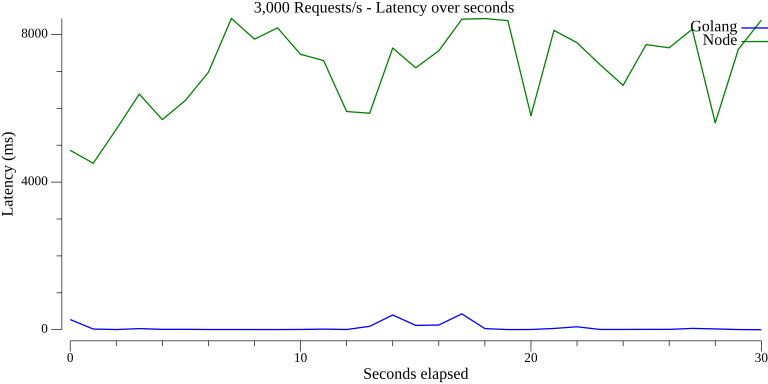
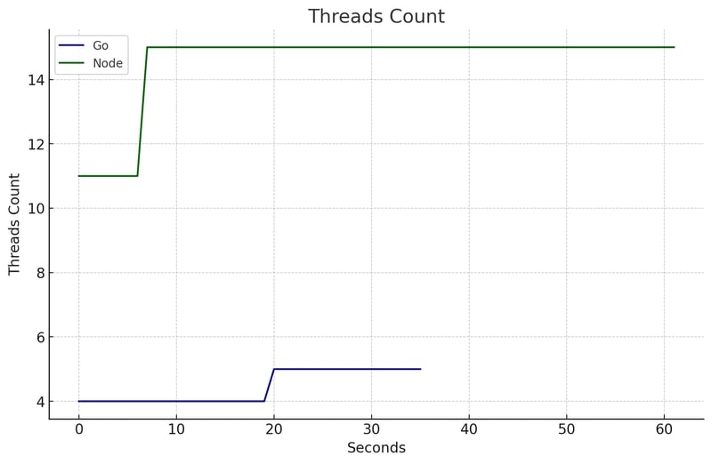
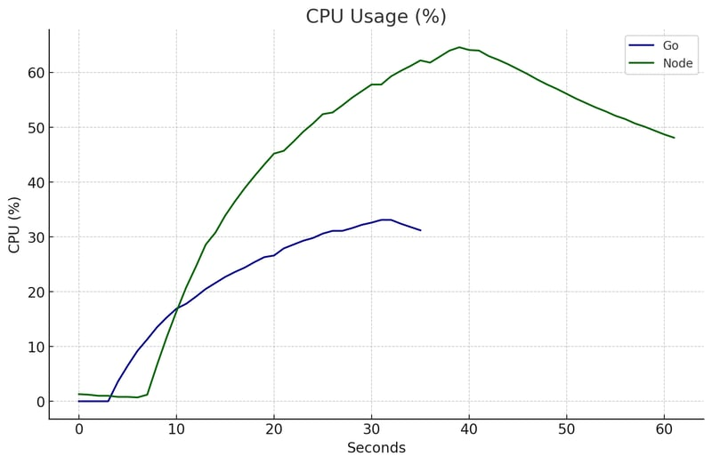
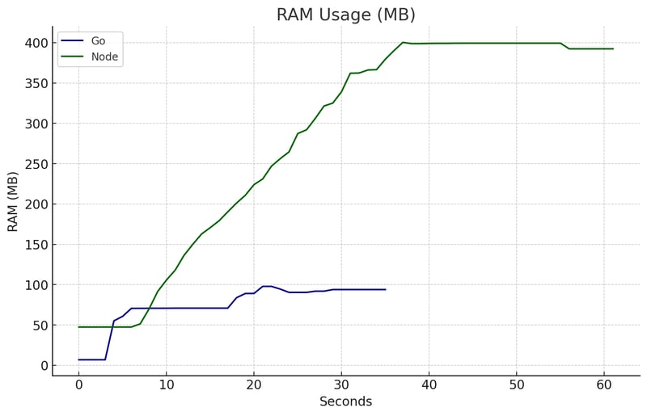
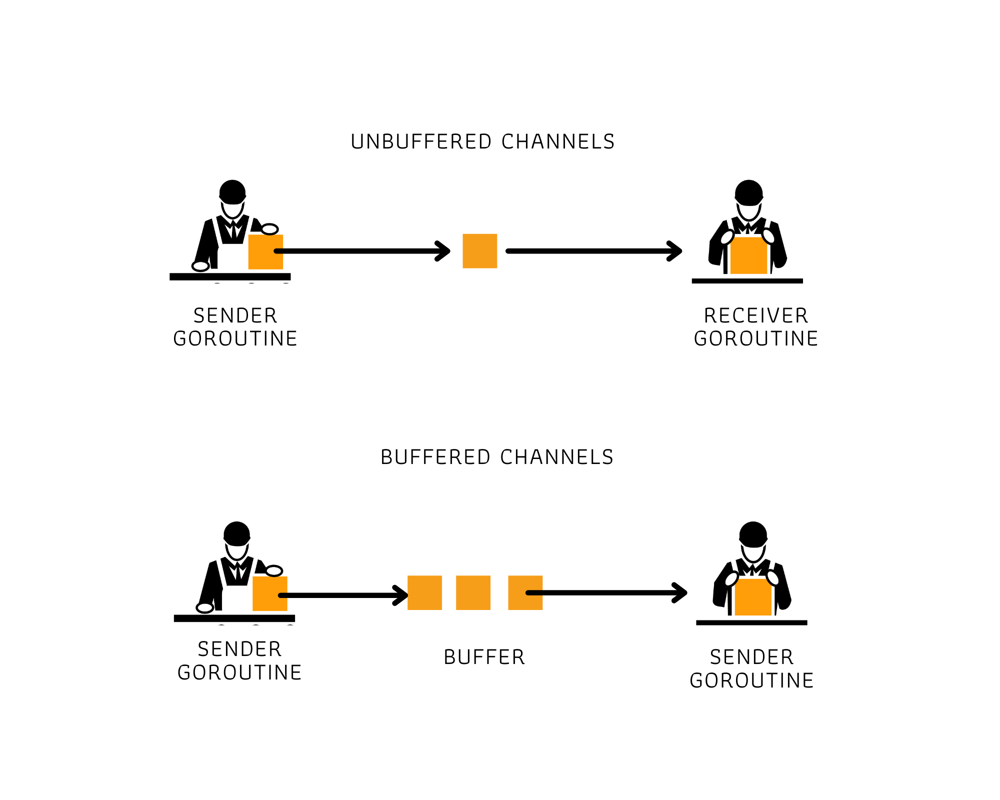
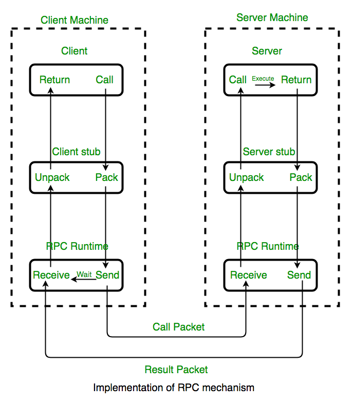
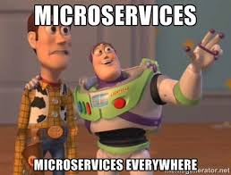
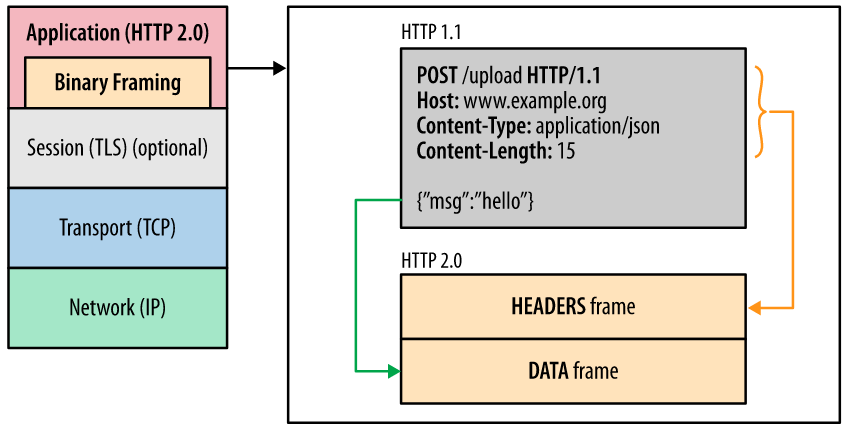
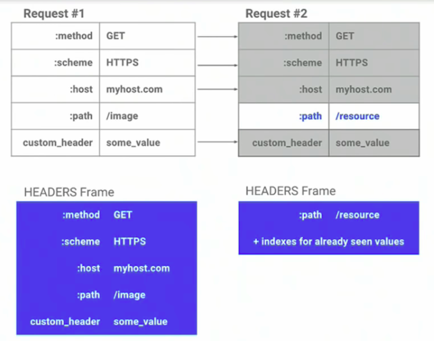

---
# You can also start simply with 'default'
theme: dracula
# random image from a curated Unsplash collection by Anthony
# like them? see https://unsplash.com/collections/94734566/slidev

# some information about your slides (markdown enabled)
title: In

# apply unocss classes to the current slide
class: text-center
# https://sli.dev/features/drawing
drawings:
  persist: false
# slide transition: https://sli.dev/guide/animations.html#slide-transitions
transition: slide-left
# enable MDC Syntax: https://sli.dev/features/mdc
mdc: true
# take snapshot for each slide in the overview
overviewSnapshots: true
---

# Intro to Golang and GRPC

<div style="display:flex; justify-content:center">
  
</div>

---

# What is Go

##

Go, or Golang, is a modern programming language developed by Google to address the challenges of large-scale, performant, and maintainable software systems.

The Go programming language was born because things were getting much more complex in the codebases within Google.

It was designed by Robert Griesemer, Rob Pike, and Ken Thompson, who all reportedly have a shared dislike for C++.

Go was announced to the public in 2009, and it was made open source in 2012 when its first version, 1.0, was released.

---

# What go can do

- Cloud & Network Services
- Command-line Interfaces (CLIs)
- Web Development
- Development Operations & Site Reliability Engineering (grafana, prometheus,docker,kube)

---

# Why using Go compare to JS (1/2)

##

### 1. Simplicity and Readability

Go emphasizes simplicity. Its concise syntax and minimalistic design make it easy to learn, especially for those familiar with JavaScript's straightforward style.
Like JavaScript, Go avoids complex abstractions, making code readable and maintainable.

### 2. Performance

Unlike JavaScript, which runs in the browser or Node.js (interpreted/JIT-compiled), Go is a statically typed, compiled language.
This makes Go significantly faster, with predictable and efficient memory usage—ideal for server-side tasks and microservices.

---

# Why using Go compare to JS (2/2)

##

### 3. Concurrency Built-in

Go has first-class support for concurrency through goroutines and channels.
Compared to JavaScript's async/await or callbacks, Go's concurrency model is lightweight and more suitable for handling multiple tasks simultaneously in backend systems.

### 4. Static Typing with Simplicity

Go provides static typing without excessive verbosity, catching errors at compile time and offering better tooling.

### 5. Cross-Compilation

You can compile Go code for multiple platforms (Linux, Windows, macOS) with ease, making it great for deploying miAmerican Express Uses Go for Payments & Rewardscroservices across diverse environments.

---

# Study Case (1/2)

## American Express Uses Go for Payments & Rewards

The problem in **American express** of that time is wanna build system payment processing needs to be fast, especially at very large transaction volumes, with resilience built across systems that must all be compliant with security and regulatory standards. so after that the do reasearch what programming language (c++,nodejs,java,golang) that match with payment team requirement

---

<div style="display:flex; justify-content:center; align-items:center;flex-direction:column;height:70vh">
  <h1>Can you guess what the result of this experiment?</h1>
</div>

---

# Study Case (2/2)

##

From a speed perspective, Go achieved the second-best performance at 140,000 requests per second. Go showed that it excels when used for backend microservices.

While Go may not have been the fastest language tested, its powerful tooling helped bolster its overall results. Go’s built-in testing framework, profiling capabilities, and benchmarking tools impressed the team. “It is easy to write effective tests in Go,” says Cane. “The benchmarking and profiling features make it simple to tune our application. Coupled with its fast build times, Go makes it easy to write well-tested and optimized code.”

Ultimately, Go was selected by the team as the preferred language for building high-performance microservices. The tooling, testing frameworks, performance, and language simplicity were all key contributors.

---

# Where u can learn golang

##

for beginner, u can start it from :

- [Go tour](https://go.dev/tour/)
- [Go By Example](https://gobyexample.com/)
- [Effective Go](https://go.dev/doc/effective_go)
- [Go Tutorial in Bahasa](https://dasarpemrogramangolang.novalagung.com/)

---

# Goroutines

##

A goroutine is a lightweight thread of execution in Go (Golang). Unlike traditional threads, goroutines are managed by the Go runtime rather than the operating system

- [source link](https://levelup.gitconnected.com/understanding-goroutines-6b1c4bc463df)


---


---

# Concurrency and parallelism in Goroutines

##

Goroutines support both concurrency and parallelism

They enable concurrency by allowing you to execute multiple tasks independently.
If your system has multiple CPU cores, Go's runtime can run goroutines in parallel on those cores.

---

# Usage of Goroutines in Backend

##

- Efficient Resource Usage:

Goroutines are lightweight compared to traditional threads, with an initial memory allocation of about 2 KB. instead thread using ~1MB. Go runtime multiplexes thousands of goroutines onto a small number of OS threads, reducing overhead.

- Improved Scalability:

Goroutines make it easy to handle high-concurrency scenarios, such as serving thousands of client requests in a web server.

- Simplified Programming Model:

Writing concurrent programs with goroutines is simpler and more readable than using threads or callbacks.
Go’s sync package and channels provide primitives for coordinating goroutines safely and effectively.

- Asynchronous Tasks:

They are ideal for background or asynchronous tasks like sending emails, logging, or processing messages in queues.


---
layout: two-cols-header
---

# Comparison Golang and Nodejs (3000 req/s)(1/2)

[source](https://dev.to/ocodista/node-vs-go-api-showdown-4njl)

::left::
## Latency


::right::
## Thread


---
layout: two-cols-header
---

# Comparison Golang and Nodejs (3000 req/s)(2/2)

[source](https://dev.to/ocodista/node-vs-go-api-showdown-4njl)

::left::
## CPU


::right::
## RAM


---

# How Goroutines Improve Speed

- Non-blocking Execution:

Goroutines can handle I/O-bound tasks without blocking the entire program. While one goroutine waits for I/O, others can continue working.

- Parallel Processing:

For CPU-bound tasks, multiple goroutines can run on different CPU cores, enabling true parallelism and faster execution.

- Preemptive Scheduling:

Go runtime includes a scheduler that efficiently manages goroutines, switching between them when needed, such as during blocking calls or idle periods.

- Reduced Context Switching:

Traditional threads require heavy context-switching overhead (saving/restoring thread state, stack, etc.).
Goroutines are managed in user-space, with lightweight context switches, leading to better performance.

---

<div style="display:flex; justify-content:center; align-items:center;flex-direction:column;height:70vh">
  <h1 style="text-align:center">Is Every goroutines able to communicate with another goroutines?</h1>
</div>

---

<div style="display:flex; justify-content:center; align-items:center;flex-direction:column;height:70vh">
  <h1>Yes</h1>
  <h2>Fun Fact: main function is also goroutines</h2>
</div>

---

# Channel

##

A channel is a communication mechanism that allows goroutines to share data safely. There's two type of channel :

- Buffered
- Unbuffered



---

<div style="display:flex; justify-content:center; align-items:center;flex-direction:column;height:70vh">
  <h1 style="text-align:center">GRPC</h1>
</div>


--- 

# What is RPC ?(1/2)

Remote Procedure Call (RPC) is a protocol that allows programs to execute a procedure (or function) on a remote server, as though it were a local function call. This abstraction simplifies distributed computing by hiding the complexity of network communication.


--- 


# What is RPC ?(2/2)



A RPC is a form of Client-Server Communication that uses a function call rather than a usual HTTP call.
It uses IDL (Interface Definition Language) as a form of contract on functions to be called and on the data type.

---

# So What is GRPC ? 

In 2015, Google open sourced their project which eventually would be the one called gRPC. But what does the "g" in gRPC actually stand for?

Lots of people might assume its for Google because Google made it, but it does not.

Google changes the meaning of the "g" for each version to the point where they even made a [README](https://github.com/grpc/grpc/blob/master/doc/g_stands_for.md) to list all the meanings.


--- 

<div style="display:flex; justify-content:center; align-items:center;flex-direction:column;height:70vh">
  <h1 style="text-align:center">Why GRPC ?</h1>
</div>


--- 

<div style="display:flex; justify-content:center; align-items:center;flex-direction:column;height:70vh">
  <h1 style="text-align:center">Microservices</h1>
  
</div>


--- 

# what makes GRPC suitable in Microservices 

 

- Abstraction is easy (it’s a function call)
- It is supported in a lot of languages
- It is very performant
- HTTP calls are often confusing, so this makes it easier

--- 

# Why Better perfomance

- HTTP/2
  - Request/Response Multiplexing

    Multiplexing is a method that allows multiple signals or data streams to be combined and transmitted over a single communication channel.
  


---

# Why Better perfomance

- HTTP/2
  - Header Compression
  
    everything in HTTP/2 is encoded before it's sent, including the headers. it not only that. HTTP/2 is able to know if the header contains the same value and only sends the header value if it is different from the previous header

  


---

# Why Better perfomance

- Protobuf
  
  Protobuf is the most commonly used IDL (Interface Definition Language) for gRPC. It's where you basically store your data and function contracts in the form of a proto file.

  ```proto
  message Person {
    required string name = 1;
    required int32 id = 2;
    optional string email = 3;
  }
  ```

  > Protobuf also has it owns mechanisms, unlike a usual REST API that just sends over strings of JSON as bytes. These mechanisms allow the payload to be much smaller and enable faster performance.


--- 

# Another feature from GRPC

- Streaming
- Call Cancellation [link](https://grpc.io/docs/guides/cancellation/)
- Load Balancing
- Retry [link](https://grpc.io/docs/guides/retry/)
- other feature


--- 


<div style="display:flex; justify-content:center; align-items:center;flex-direction:column;height:70vh">
  <h1 style="text-align:center">Q and A</h1>
</div>


--- 


<div style="display:flex; justify-content:center; align-items:center;flex-direction:column;height:70vh">
  <h1 style="text-align:center">Thank you</h1>
</div>